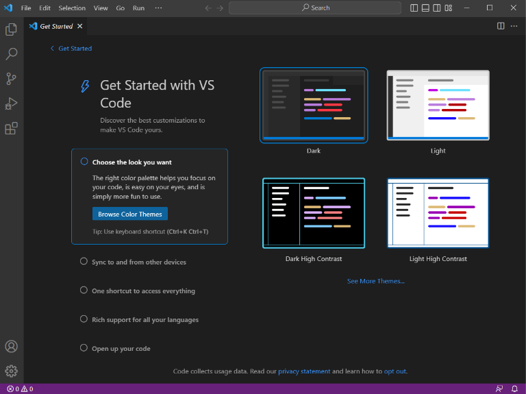
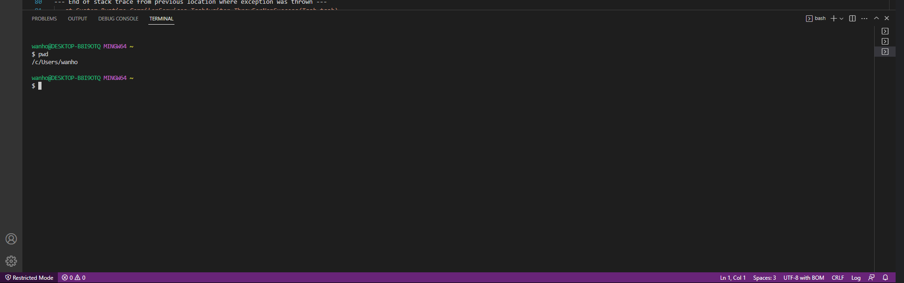
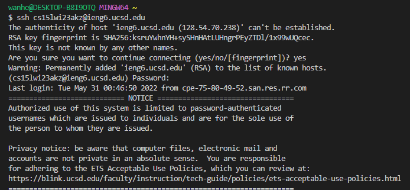
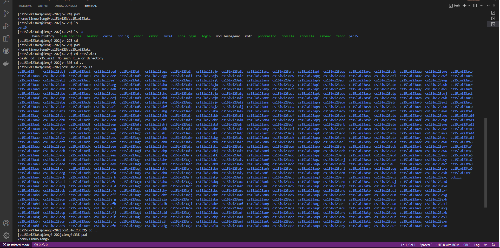

# Lab Report 1
> Written by Hou Wai Wan for CSE 15L Winter 2023

This lab report details the steps required to remotely access a server using SSH (Secure Shell). This remote account in particular will be the UCSD course specific account on **ieng6**. There are 3 recommended steps required for this process:

**1) Installing the IDE Visual Studio Code (VSCode):**
* Go to the link https://code.visualstudio.com/ and follow the installation instructions depending on your OS (Windows, Mac, Linux).
* You should see something like this once have followed the installation instructions and opened VSCode. 

  

**2) Remotely connecting to the server using Git Bash:**
* To access to your UCSD provided remote server (your **ieng6** account), you will have to install git on your local computer and ultilize the GIT Bash command line interface. We will be doing this in VsCode instead of opening GIT Bash as a standalone window. 
* Please go to this link and once again follow the instructions: https://gitforwindows.org/
* To use Bash in VsCode, you will have to open an integrated Bash CLI in VsCode. Please follow these instructions here: https://stackoverflow.com/a/50527994
* You shold see something like this in your VsCode terminal if everything is done correctly!
* To remotely connect to the server, you will have to use the SSH command in bash with your UCSD provided address. For example, my address is *cs15lwi23akz@ieng6.ucsd.edu*.

<ins>Using Git bash</ins>

<ins>Using the ssh command with login details</ins>

**3) Some example terminal commands you can use on the CLI:**
* Once you have connected to your remote server, you are now ready to run some terminal commands!
* Some commands you can try include:
 1) *ls* --> List files in crrent directory
 2) *cd* --> Change directory
 3) *pwd* --> Print working directory
 4) *cat* --> Concatenate files
* To exit your server, you can use the command **Ctrl-D**.
 
 <ins>Some example commands in my own server</ins>
 
 
