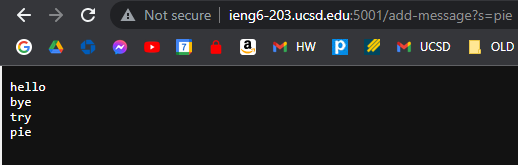

# Lab Report 2
> Written by Hou Wai Wan for CSE 15L Winter 2023

## Part 1 - Building a web server for string concatenation 

**StringServer Code**

**Usage of the add-message path - Example 1**

> In example 1, the add-message path requests the server to add a String from the path into the existing String "input". This is done by concatenation
via the "handleRequest" method. The handleRequest method only takes in one argument, a URI object named "url". The method itself initializes a field String variable
"input" with the value of an empty string. An array of String objects is also used to split the value of "s" in the url path into the string value to be concatenated
onto the input. If the request for add-message is valid, the "input" field is updated via concatenation with a new line and the string from the path. 

> In the case of example 1, the string "hello" is the sole input. As this is the first request however, no concatenation is needed and the input field is just replaced by the "hello" string. This is done through an if conditional statement in the "handleRequest" method.

**Usage of the add-message path - Example 2**

> In example 2, the "handleRequest" is called 3 times after the initial request for adding the string "hello". The same "add-message" path is called 3 times
consecutively with the values of "bye", "try", and "pie". These are concatenated with a newline onto the existing field "input". As in example 1, the only arguments 
used for the "handleRequest" method is just the path URL. Instead of the initial if conditional being executed, the code defined in the else part of the conditional 
is executed. This is because the field "input" is no longer an empty string.
