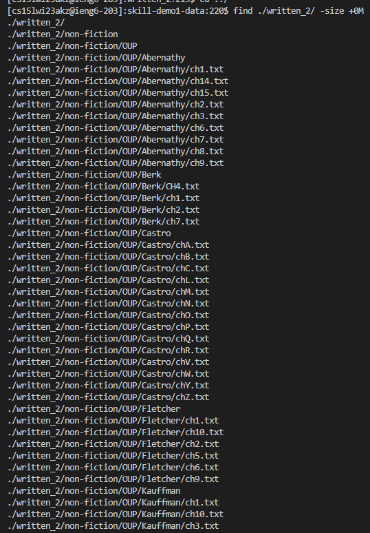
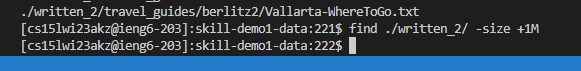

# Lab Report 3
> Written by Hou Wai Wan for CSE 15L Winter 2023

## Comman-line options for the "find" command

1) -size
`find ./written_2/ -size +0M`

**Output:**

`find ./written_2/ -size +1M`

**Output:**

2) -name
`find ./written_2/ -name "China-History.txt"`

**Output:**

`find ./written_2/ -name "*.txt"`

**Output:**

3)

4) 
