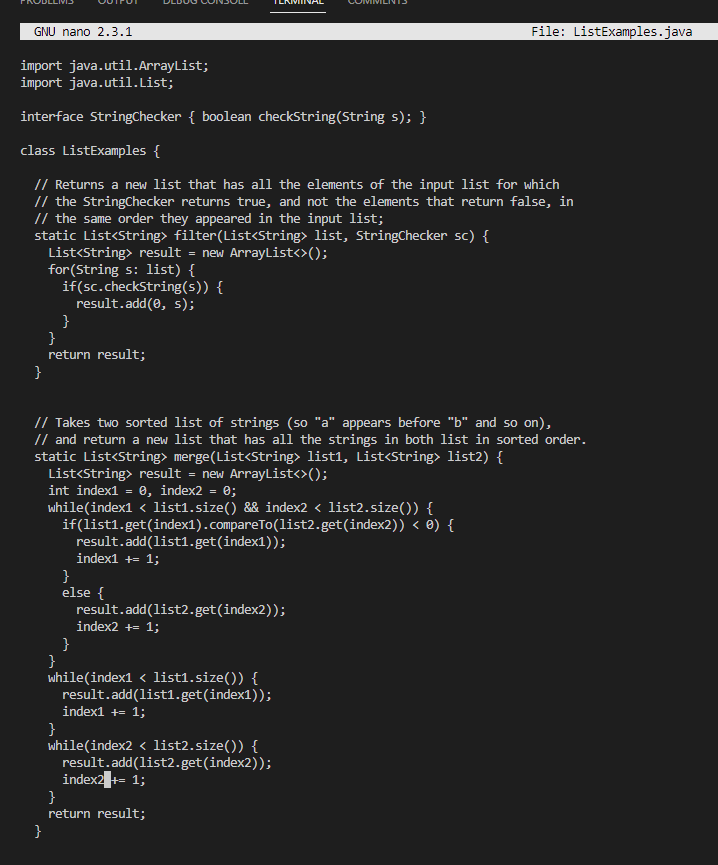

# Lab Report 4
> Written by Hou Wai Wan for CSE 15L Winter 2023

## Every Key I Pressed Doing The Challenge Tasks

**Step 4) Log into ieng6**

*Keys I pressed: `<type in "ssh"> <ctrl + c> <ctrl + v> <enter> <type in password> <enter>`*

> First I opened up git bash. I then accessed my ieng6 account by copying and pasting my account name and executing it with the ssh command. I then typed in my password for said account.

**Step 5) Clone your fork of the repository from your Github account**

*Keys I pressed: `<type in "git clone"> <ctrl + c> <ctrl + v> <enter>`*

> First I went to the lab 7 repo on github and forked it onto my own GitHub account. I then copied and pasted the github clone SSH link of the forked repo into the command line after the command "git clone". I then executed the command of cloning the repo by pressing enter.

**Step 6) Run the tests, demonstrating that they fail**

*Keys I pressed: `<type out "cd lab7"> <type out "javac -cp .:lib/hamcrest-core-1.3.jar:lib/junit-4.13.2.jar *.java"> <type out "java -cp .:lib/hamcrest-core-1.3.jar:lib/junit-4.13.2.jar org.junit.runner.JUnitCore ListExamplesTests"> <enter>`*

> After cloning the lab7 forked repo, we first have to change to the directory of lab7 to have access to the ListExamples and its tester java files. To run the test, we first have to compile all the java files with the JUnit tester library from the /lib sub-directory. After this is successfully completed, we can run the JUnit test using the java command on the "ListExamplesTests" class file. The output should have 2 tests run with one failure.

**Step 7) Edit the code file to fix the failing test**

*Keys I pressed: `<type in "nano ListExamples.java"> <down> ~till we reach the 3rd while loop with the bug <down> <down> <right> ~till the end of the line with "index += 1" <change variable from "index1" to "index2"> <ctrl+x> <y> <enter>`*

> As there is a bug in the "ListExamples.java" file, we have to access the code through bash to edit and correct the code. We can do this using nano, a terminal-based text editor, by ultilizing the "nano" command followed by the name of the file we want to edit. Once we access the "ListExamples.java" file, we use the arrow keys to place our cursor in the 3rd while loop of the java file, which is where the bug is. The bug is basically incrementing the wrong index when appending elements to list2, causing us to fail our JUnit test. To fix this we simply cahnge the variable being incremented by 1 from "index1" to "index2". Once this is done, we save and exit the file by pressing ctrl+x, y, and enter. Now our "ListExamples.java" file is updated and corrected.

**Step 8) Run the tests, demonstrating that they now succeed**

**Step 9) Commit and push the resulting change to your Github account**
